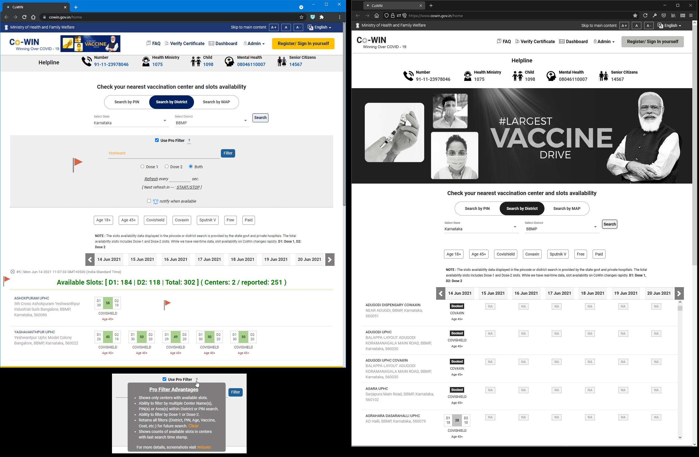
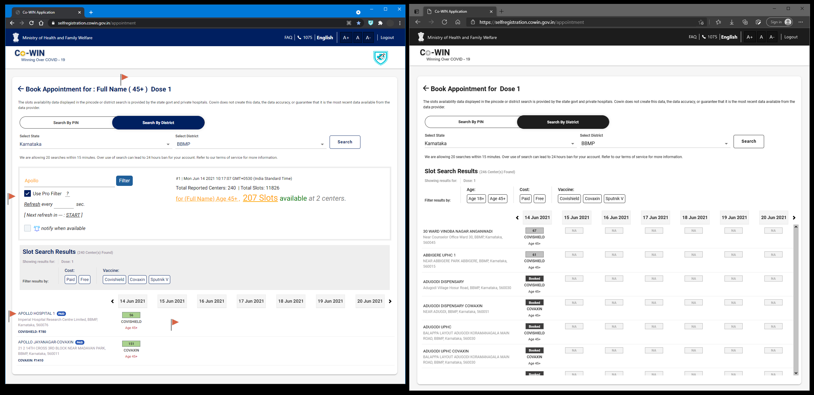
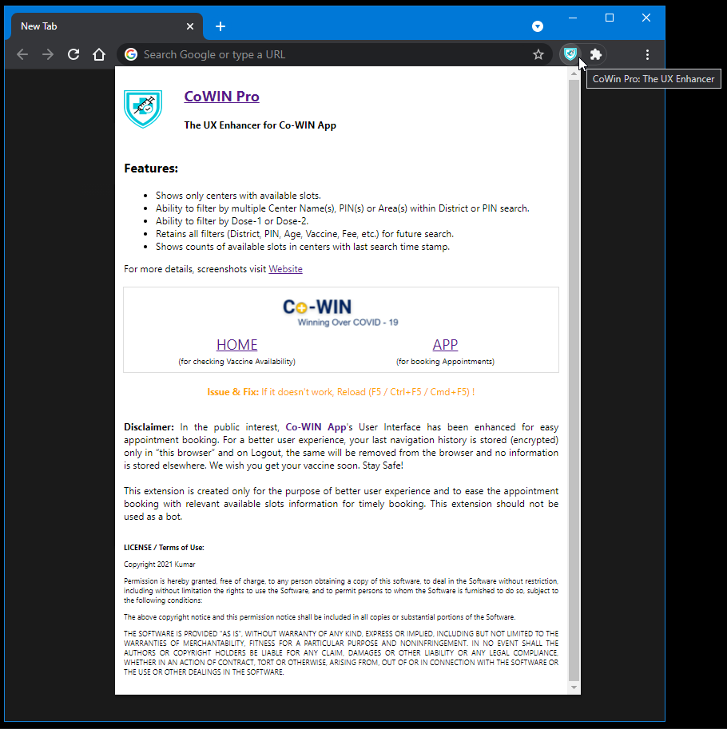

#  **CoWin Pro**

## The First Browser (Chrome / Edge) Extension aims to enhance the User Experience / Usability of India's [Co-WIN App](https://selfregistration.cowin.gov.in/).

 In the public interest, this browser extension was created to enhance India's [Co-WIN App](https://selfregistration.cowin.gov.in/)'s User Interface for easy appointment booking. Hope it will ease your vaccine booking process.

 

>**NOTE:** This extension is available in [Chrome Web Store](https://chrome.google.com/webstore/detail/cowin-pro/leebmggfmncbgjnjlfbbekamkiimhlkl) for Public use.

 

---

## Screens
👍 Enhanced Search Results ! 

- Shows only centers with available slots.
- Ability to filter by multiple Center Name(s), PIN(s) or Area(s) within District or PIN search.
- Ability to filter by Dose-1 or Dose-2.
- Retains all filters (District, PIN, Age, Vaccine, Cost, etc.) for future search.
- Shows counts of available slots in centers with last search time stamp.

About 

---

Give it a try and experience, you will love it ♥.

Take Care, Stay Safe.

---

>**NOTE:** This extension is for Desktop Chrome / Edge. For mobile, use [Kiwi Browser](https://kiwibrowser.com/) and visit [Chrome Web Store](https://chrome.google.com/webstore/detail/cowin-pro/leebmggfmncbgjnjlfbbekamkiimhlkl) to install this extension.
