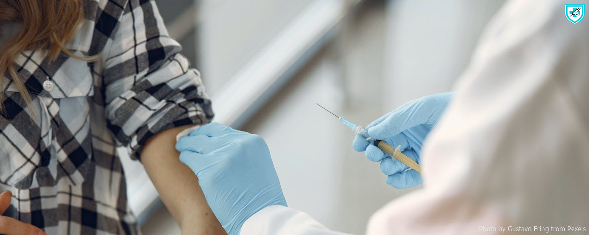
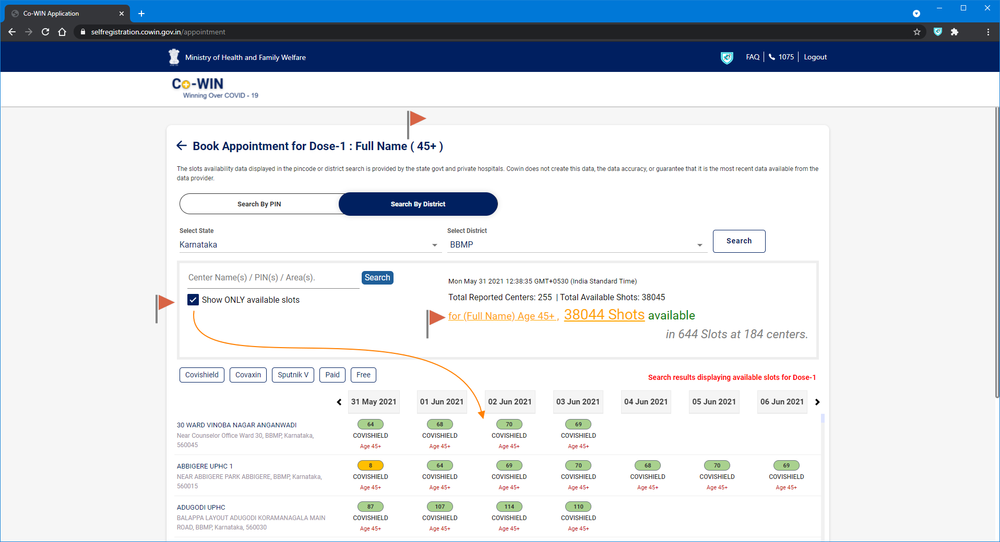
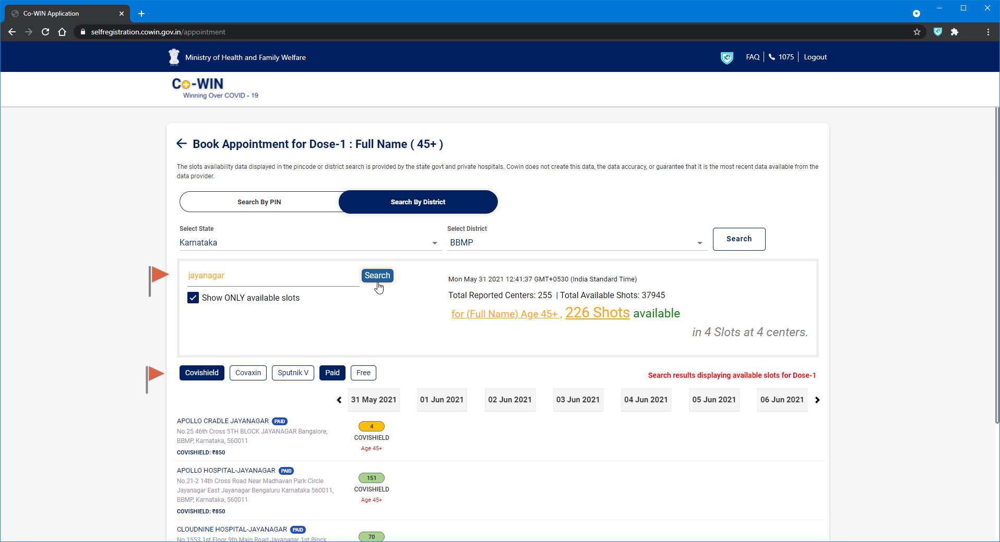
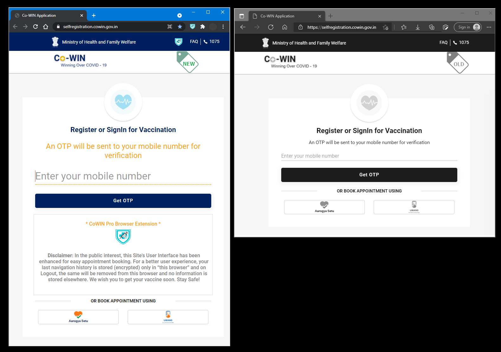
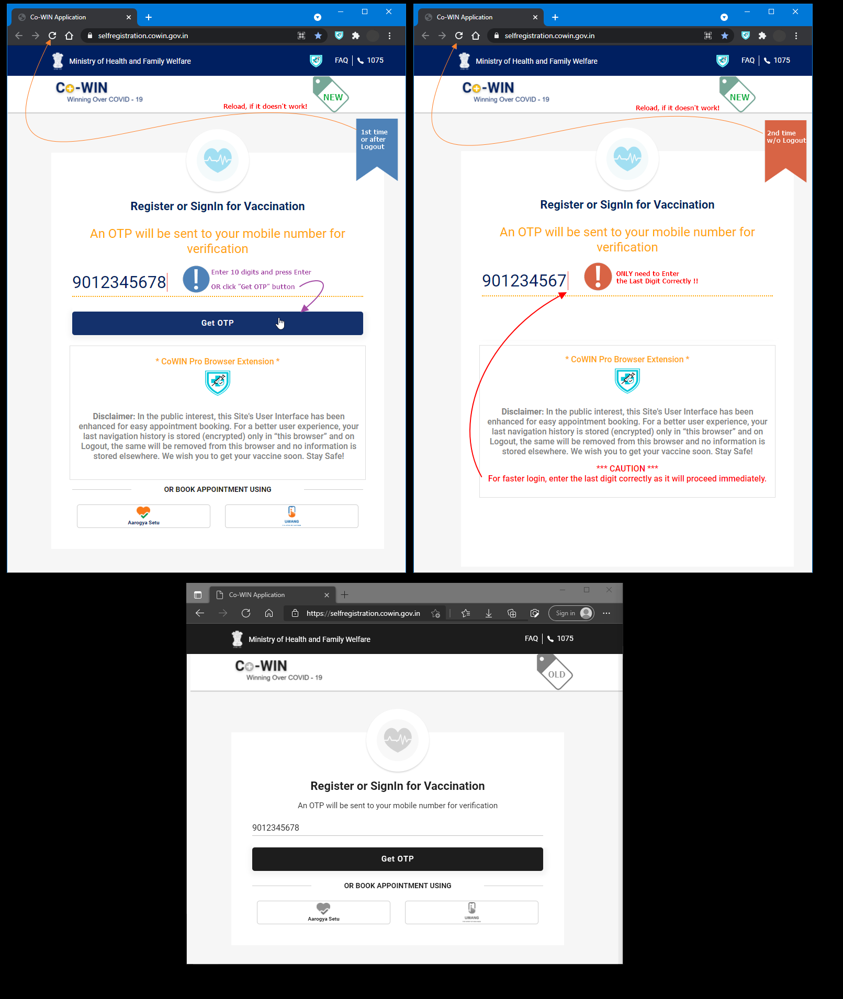
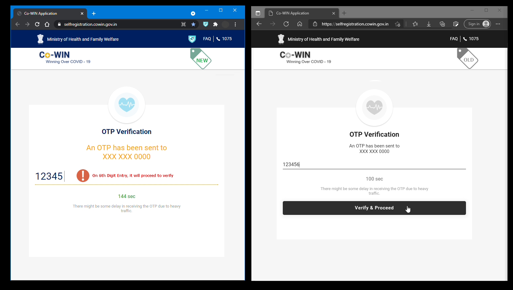
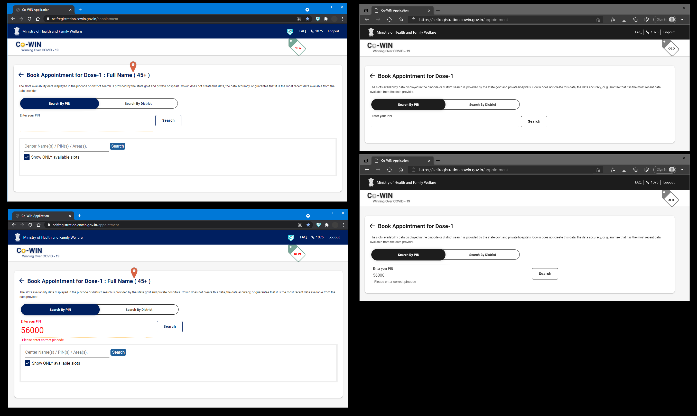
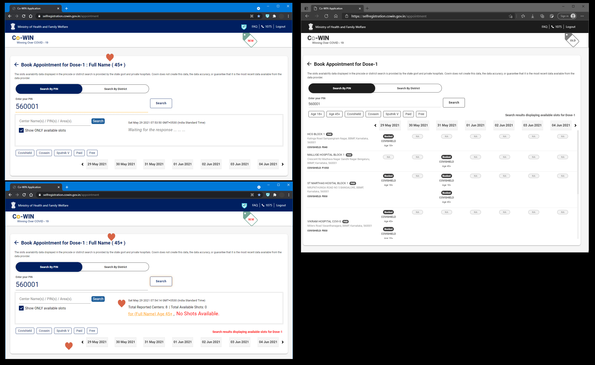
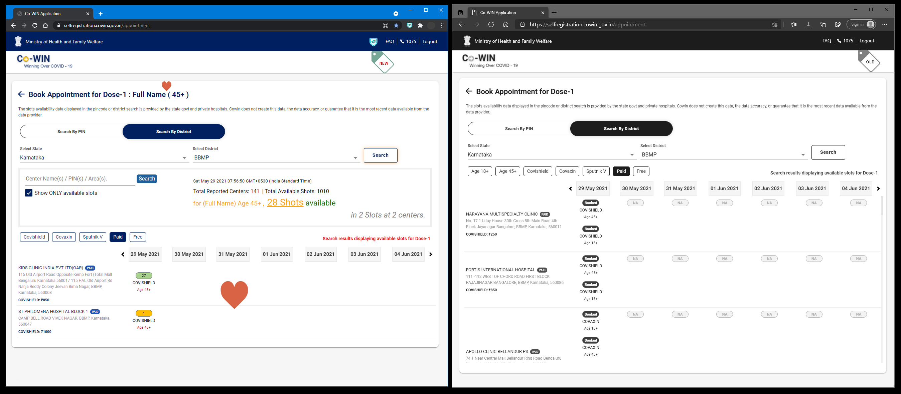

#  **CoWin Pro**

## The First Browser (Chrome / Edge) Extension aims to enhance the User Experience / Usability of India's [Co-WIN App](https://selfregistration.cowin.gov.in/).

 In the public interest, I created this browser extension to enhance India's [Co-WIN App](https://selfregistration.cowin.gov.in/)'s User Interface for easy appointment booking. Hope it will ease your vaccine booking process.

 

>**NOTE:** This extension has been submitted in [Chrome Web Store](https://chrome.google.com/webstore/category/extensions?hl=en-IN) and [Edge Add-ons Store](https://microsoftedge.microsoft.com/addons/Microsoft-Edge-Extensions-Home?hl=en-IN) for Public use ( 🤞 Hope, it will be visible soon ! ). Meanwhile if you want to give it a try, follow the [manual installation guide](README-CoWinPro-Chrome+Edge-Extension-ManualInstall-Guide.pdf).

 **Manual Install:** Download this repo zip, unzip and follow this [installation guide](README-CoWinPro-Chrome+Edge-Extension-ManualInstall-Guide.pdf).
 

---

## Screens
👍 Enhanced Search Results ! 

👍 Advance Filter !! 

👍 Login Screen Enhancements 

* Initial

* Second Time Login

* OTP Verification

👍 Enhanced Search Results 

* Search By PIN

* Search By PIN Results

* Search By District Results

---

Give it a try and experience, you will love it ♥.

Take Care, Stay Safe.

---

>**NOTE:** This extension is for Desktop Chrome / Edge and not for mobile.
